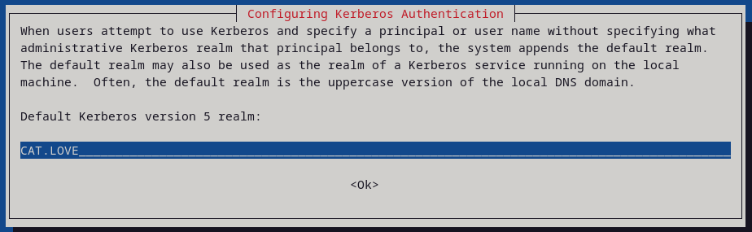
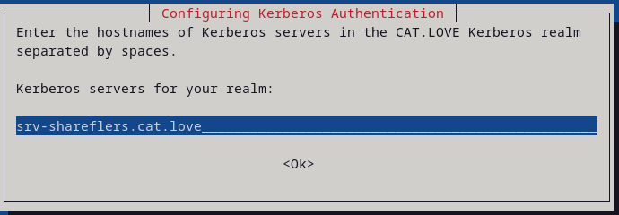

# Configuration du partage SMB via kerberos

**IMPORTANT :** il s'agit d'une documentation. Modifiez les paramètres en fonction de votre matériel et de vos exigences.

AD = srv-shareflers.cat.love | 192.168.150.90

SV = srv-ActiveV | 192.168.150.22

---

## Prérequis : Créer le répertoire du paratage
```
sudo mkdir -p /srv/partage/objects
sudo mkdir -p /srv/partage/events
```

## Étape 1 : Installer les packages nécessaires et
```
sudo apt -y install winbind libpam-winbind libnss-winbind krb5-config samba
```

Pendant l'installation vous allez être invité à préciser votre nom de domaine, **majuscule obligatoire** 


préciser votre serveur AD pour les deux prochaines entrées.


## Étape 2 : Sauvegarder et configurer le fichier smb.conf
```
sudo mv /etc/samba/smb.conf /etc/samba/smb.conf.back
sudo nano /etc/samba/smb.conf
```

Exemple de configuration pour le domaine **CAT.LOVE**

**/etc/samba/smb.conf**
```
workgroup = CAT
password server = srv-shareflers.cat.love
realm = CAT.LOVE
security = ADS
idmap config * : range = 16777216-33554431
template homedir = /home/%D/%U
template shell = /bin/bash
winbind use default domain = true

[partage]
        path = /srv/partage/
        valid users = "@CAT\GDL_SVAD_SMB-WO"
        force group = "GDL_SVAD_SMB-WO"
        writable = yes
        read only = no
        force create mode = 0660
        create mask = 0777
        directory mask = 0333
        access based share enum = yes
        hide unreadable = yes
```

Il faut mettre l'ip du serveur AD en DNS principal
```
echo "dns-nameservers $ipServerAD"| sudo tee -a 
/etc/network/interfaces
```

Puis ensuite il faut redémarrer le service `networking`
```
sudo systemctl restart networking.service
```

## Étape 3 : Joindre le domaine et appliquer les droits au partage
```
net ads join -U "DLGUSER01"
sudo mkdir /srv/partage
sudo chmod 333 /srv/partage
mkdir /srv/partage/objects
mkdir /srv/partage/events
systemctl restart winbind smbd nmbd
```

